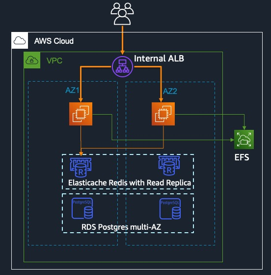
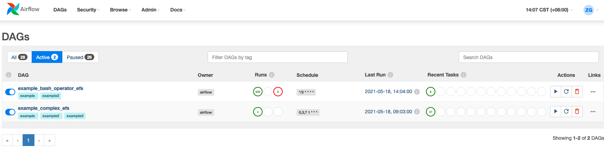

## HA Airflow setup

### Background

- Airflow setup in China regions to orchestrate complex Glue workflows
- As AWS MWAA (AWS managed Airflow) is not yet launched in China, an HA airflow setup with less operation overhead is required. 
- Airflow Glue operators, under the hood, connect to Glue API endpoint, launch the job with running arguments and polls on the job running status. The workload in Celery workers in Airflow is relatively low.

### Deployment Architecture



#### Cross-AZ HA setup

- Both EC2 running
  - Airflow web server
  - Airflow scheduler (Airflow 2.0+ supports multi schedulers)
  - Celery worker

- EFS file share mounted on both EC2 for DAG sharing

- Elasticache Redis (Cluster mode disabled) for Celery broker
  - Celery doesn’t support cluster-mode Redis
  - EC Redis with Read replica for HA and failover is transparent to application

- Airflow supports both MySQL and PostgresSQL
  - Example of RDS PostgresSQL multi-AZ for Airflow database
  - PostgreSQL 9.6+ or MySQL 8+ for optimal multi scheduler support

### Setup Guide

1. #### Create EFS file share

   ##### Create Security Group of EFS

   Create security group for EFS

   ##### Create EFS File system

   ```bash
   export AF_REGION=cn-north-1
   export AF_FS_ID=$(aws efs create-file-system \
     --creation-token airflow-shared \
     --performance-mode generalPurpose \
     --throughput-mode bursting \
     --region $AF_REGION \
     --encrypted \
     --output text \
     --query "FileSystemId")
   ```

   ##### Create mount targets

   Find the 2 subnet IDs of Airflow EC2 and for every subnet ID, run

   ```bash
   aws efs create-mount-target \
     --file-system-id $AF_FS_ID \
     --subnet-id <subnet_id> \
     --security-group <SG_id> \
     --region $AF_REGION
   ```

2. #### RDS Postgres setup

   Airflow supports both MySQL and PostgreSQL as database backend. We use PostgresSQL as an example.

   - Postgresql 9.6+ (multi scheduler is optimal with PostgresSQL 9.6+)

   - Multi-AZ and storage autoscaling enabled 

     ```bash
     aws rds create-db-subnet-group \
        --db-subnet-group-name airflow-postgres-subnet \
        --subnet-ids <db-subnet ids> \
        --db-subnet-group-description "Subnet group for Airflow Postgres RDS" \
        --region $AF_REGION
     aws rds create-db-instance \
       --db-instance-identifier airflow-postgres \
       --db-instance-class db.m4.large \
       --db-name airflow_db \
       --db-subnet-group-name airflow-postgres-subnet \
       --engine postgres \
       --engine-version 12.5 \
       --master-username airflow_user \
       --master-user-password <password> \
       --allocated-storage 50 \
       --no-publicly-accessible \
       --max-allocated-storage 200 \
       --multi-az \
       --region $AF_REGION
      # After the RDS instance is up, get the endpoint
     export AF_RDS_ENDPOINT=$(aws rds describe-db-instances \
       --db-instance-identifier airflow-postgres \
       --query 'DBInstances[0].Endpoint.Address' \
       --region $AF_REGION \
       --output text)
     ```

3. #### ElastiCache Redis setup

   EC Redis is used for Celery broker. As Celery doesn't support for Redis cluster mode, we set up EC Redis (cluster mode disabled) with replica for HA purpose. 

   ```bash
   aws elasticache create-replication-group \
      --replication-group-id airflow-redis-repl-group \
      --replication-group-description "HA redis cluster with replicas" \
      --num-cache-clusters 2 \
      --multi-az-enabled \
      --automatic-failover-enabled \
      --engine redis \
      --engine-version 5.0.6 \
      --region $AF_REGION
   export REDIS_ENDPOINT = $(aws elasticache describe-replication-groups \
   --replication-group-id airflow-redis-repl-group \
   --region $AF_REGION \
   --query 'ReplicationGroups[0].NodeGroups[0].PrimaryEndpoint.Address')
   ```

4. #### Setup EC2

   - ##### Create security group for both EC2

     Ingress will allow only for ALB

   - ##### Create EC2 in the private subnet

   - ##### Mount EFS file share for DAG

     ```bash
     mkdir /airflow
     sudo mount -t nfs4 -o nfsvers=4.1,rsize=1048576,wsize=1048576,hard,timeo=600,retrans=2,noresvport <AF_FS_ID DNS name>:/ /airflow
     # copy the DAG files to /airflow/dags/
     ```

     Airflow installation

     ```bash
     sudo yum install -y python37
     export AIRFLOW_HOME=~/airflow
     AIRFLOW_VERSION=2.0.2
     pip3 install "apache-airflow==${AIRFLOW_VERSION}" --constraint "${CONSTRAINT_URL}"
     pip3 install 'apache-airflow[celery]' 'celery[redis]' celery[sqlalchemy] psycopg2-binary
     PATH=$PATH:~/.local/bin
     airflow db init #this will fail but creates the airflow.cfg in AIRFLOW_HOME directory
     ```

     In airflow.cfg update the following

     ```bash
     [core]
     dags_folder = /airflow/dags
     executor = CeleryExecutor
     sql_alchemy_conn = postgresql+psycopg2://airflow_user:<password>@<RDS_ENDPOINT>/airflow_db
     [celery]
     broker_url = redis://<redis primary endpoint>:6379/0
     result_backend = db+postgresql://airflow_user:<password>@<RDS_ENDPOINT>/airflow_db
     ```

     Start Airflow 

     ```bash
     airflow db init
     airflow users create --username <user name> --firstname <first name> --lastname <last name> --role Admin --email <email>
     airflow webserver -D
     airflow celery worker -D
     airflow scheduler -D
     ```

     Set up the second Airflow server or create image of the first Airflow server and launch from the image.

5. #### ALB setup


